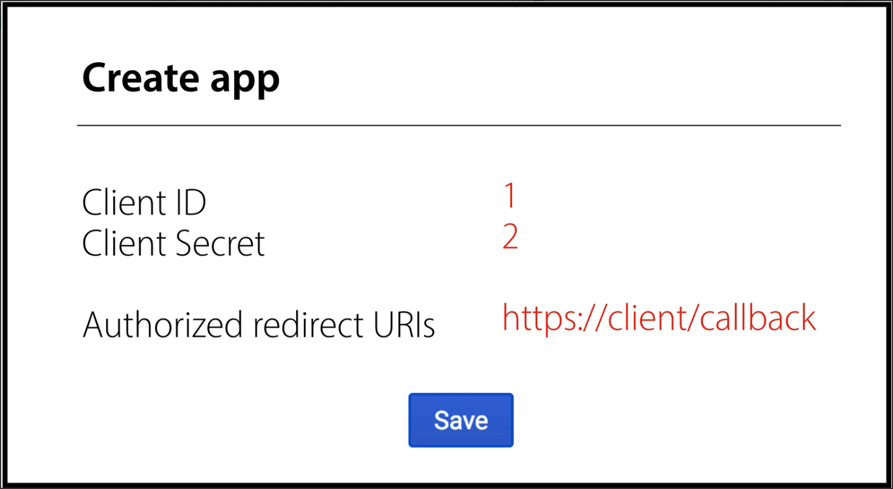
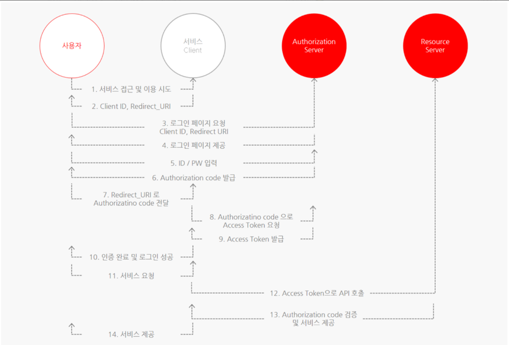
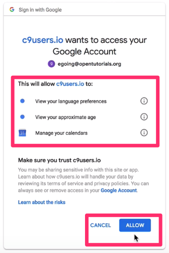

## OAuth2.0 이란?
인증을 위한 개방형 표준 프로토콜
Third-Party 프로그램에게 리소스 소유자를 대신하여 리소스 서버에서 제공하는 자원에 대한 접근 권한을 위임하는 방식을 제공한다.
|--> Third-Party 프로그램에는 구글, 페이스북, 카카오, 네이버 등이 있음

### 주요 용어
4개의 개념에 대해 알아야 한다.
1. Resource Owner
로그인을 하려는 사용자
ex. 유저
2. Client
리소스를 사용하고자 접근 요청을 하는 어플리케이션(내가 만든 Spring BOOT Server)
ex. ㅇㅇ앱
3. Resource Server
Resource Owner의 정보가 저장되어 있는 서버, Access Token을 검증하고 **여러 데이터들(이메일, 성별)을 제공**하는 서버
ex. 카카오, 네이버
4. Authorization Server
클라이언트의 접근 자격을 확인하고 **Access Token을 발급**하여 권한을 부여하는 서버
ex. 카카오, 네이버 
-> 3,4번은 공식문서상 별개로 구분되어 있지만, 별개의 서버로 구상할지 하나의 서버로 구상할지는 개발자가 선택하기 나름임

### 권한 부여 방식
1. Authorization Code Grant(권한 코드 승인 방식) **
    서버 사이드에서 인증 처리하는 경우 이 경우 많이 사용함
2. Implicit Grant(암시적 승인 방식)
    서버 없이 클라이언트 측에서 간편하게 사용할 경우
3. Resource Owner Password Credentials Grant(리소스 소유자 비밀번호 자격 증명)
    카카오 - 카카오맵, 카카오 스타일 등 계열사로 접근할 때 간단히 username, password로 바로 Access Token 요청
4. Client Credentials Grant(클라이언트 자격증명 승인 방식)
   Client와 Resource Owner가 같을 때, 즉 우리가 만든 커뮤니티 사이트에서 이용하는 이미지, CSS, JS 파일 등을 구글 클라우드 서비스에 올려놓고 사용할 때

### 서비스 등록 시 받게되는 필수요소
Client ID- 어플리케이션(서비스)을 식별하는 식별자ID
Client Secret- Client ID에 대한 비밀번호로 외부에 노출되면 안됨
Authorized redirect URIs- Resource Server만 갖는 정보로, client에 권한을 부여하는 과정에서 나중에 Authorized code를 전달하는 통로 , 개인정보를 콜백할 주소
scope- email, 이름 ,, 등 그 서비스 안에서 사용할 수 있는 기능들


### 권한 코드 승인 방식에 대해 알아보자

1. 어떤 ㅇㅇ앱에서 로그인 페이지에 접근 -> 소셜로그인 시도
2. 그러면 사용자에게 로그인 페이지(Login with GOOGLE)를 제공한다.
3. 사용자가 이 버튼을 누르면 특정한 url이 구글 서버 쪽으로 보내진다.
```http request
Location: https://resource.server/?client_id=1&scope=B,C&redirect_uri=https://client/callback
이 URL로 대신 로그인할 수 있도록 도와준다.
https://resource.server/? # 리소스 서버(네이버, 카카오 사이트 url)
client_id=1 # 어떤 client인지를 id를 통해 Resouce Owner에게 알려주는 부분
&scope=B,C # Resource Owner가 사용하려는 기능, 달리 말해 client가 자신 서비스에서 사용하려는 Resource Server 기능을 표현한 부분
&redirect_uri=https://client/callback # 개발자 홈페이지에 서비스 개발자가 입력한 응답 콜백.
```
4. 클라이언트로부터 보낸 서비스 정보와, 리소스 로그인 서버에 등록된 서비스 정보를 비교한다.
    ->확인이 완료되면 Resource Server로부터 전용 로그인 페이지로 이동하여 사용자에게 보여준다.
5. ID/PW를 적어서 로그인하게 되면 client가 사용하려는 기능(scope)에 대해 Resource Owner의 동의를 요청한다.

이 이미지의 의미는 다음과 같다.
"ㅇㅇ라는 서비스(앱)은 Resource Owner를 대신해 해당 기능(scope들)을 사용하려고 합니다. 동의하시겠습니까?   
동의를 누르면 Resource Owner가 Client에게 해당 기능 사용을 위임한 것 !"
->동의를 누르면 Resource Owner가 권한을 위임했다는 승인이 Resource Server에게 전달됨
6. ㅇㅋ 이제 Resource Server의 허락을 받아야 함. Resource Server도 Client에게 권한을 승인해주기 위해 Authorization code를   
Redirect URL을 통해 사용자에게 Authorization code 발급해줌
```http request
Location: https://client/callback?code=3
```
7. 다시 사용자는 그대로 Client에게 다시 보냄 Redirect_URI와 Authorization code
8. 이제 Client가 Resource Server에게 직접 URL(Client Id, Client Secret, Authorization code 등을 보낸다)
9. Resource Server는 Client가 전달한 정보들을 비교해서 일치한다면, Access Token 발급
10. 그리고 이제 Authorization code는 필요없어져서 지움
11. Client는 Access Token 받았으니 최종적으로 로그인이 완료되었다고 응답
12. 이제 Client는 이제 Resource Server의 API를 요청해 Resource Owner의 ID 또는 프로필 정보를 사용 가능