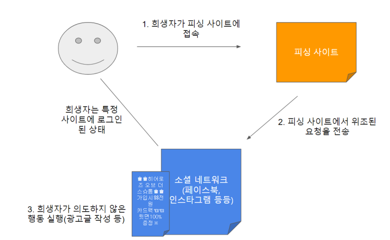
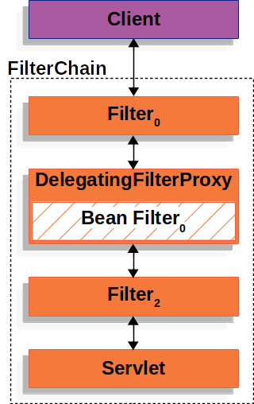
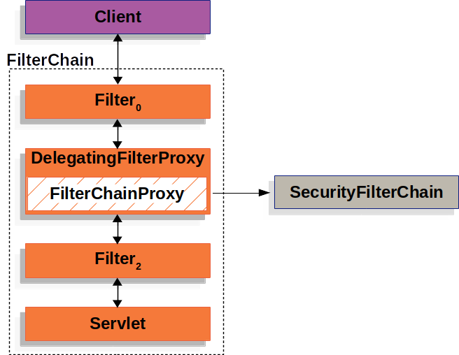
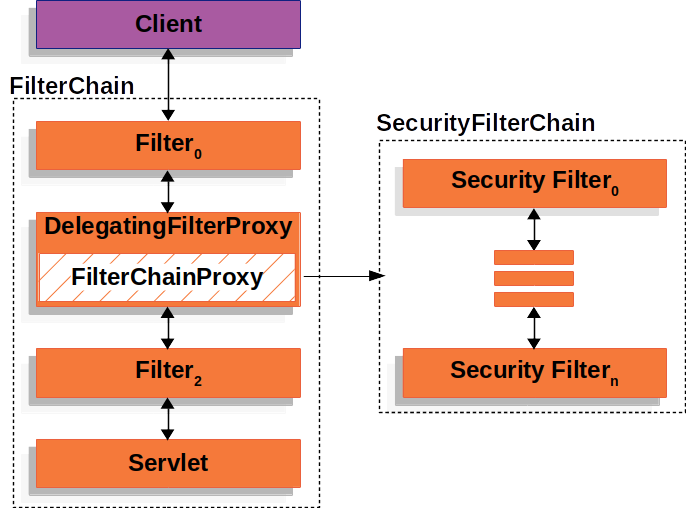

# Filter
### Filter가 대체 뭐야   
   
한 HTTP Request를 받으면 여러 계층화된 필터들을 통과하게 된다.   

♻ FilterChain 및 Servlet
클라이언트가 요청을 보내면 서버는 해당 요청에 대한 처리를 위해 FilterChain 생성   
이 FilterChain은 여러개의 Filter 인스턴스와 실제로 요청을 처리할 Servlet이 포함되어 있다.    
MVC 패턴에서는 이 Servlet을 DispatcherServlet이라고 부름   

하나의 Servlet 이 하나의 HTTP 요청(HttpServletRequest)/응답(HttpServletResponse) 처리 ,    
그리고 그 안에 여러 개의 Filter 사용될 수 있음

♻ Filter의 활용
Spring MVC가 사용하는 Servlet은 DispatcherServlet이다. Servlet 인스턴스 하나당 HttpServletRequest, HttpServletResponse 인스턴스 각 하나씩 들고있지만 두 개 이상의 필터를 사용하면 다음과 같이 유동적은 흐름을 수행할 수 있다.

특정 조건을 만족하는 경우 다운스트림(Client → Servlet 방향) 필터 또는 서블릿이 호출되지 않도록 할 수 있다. 그렇게 해당 서블릿 필터가 속하는 지점에서 멈출 경우 필터는 HttpServletResponse를 작성한다.
필터에서 아래에 있는 다운스트림 필터 및 서블릿으로 이동하면서 각 사용하는 HttpServletRequest 또는 HttpServletResponse를 연동하여 수정할 수 있다.


Filter의 진정한 면모는 스트림을 통과하며 동작하는 FilterChain에서 나온다. 각 필터는 다운스트림 필터와 서블릿에만 영향을 미치므로 각 필터가 호출되는 순서는 매우 중요하다.
```java
public void doFilter(ServletRequest request, ServletResponse response, FilterChain chain) {
    // do something before the rest of the application
    chain.doFilter(request, response); // invoke the rest of the application
    // do something after the rest of the application
}
```

### DelegatingFilterProxy
서블릿 컨테이너의 생명주기와 Spring의 ApplicationContext사이의 브릿징 역할
    
서블릿 컨테이너는 자체적인 필터 등록 방식을 가지고 있다.   
보통 web.xml 파일에서 필터를 설정하거나 @WebFilter 어노테이션을 사용해야 한다.    
또는 FilterRegistrationBean 클래스를 사용해 스프링 빈으로 등록해야 함   

따라서 DelegatingFilterProxy와 그 내부에 위임대상(FilterChainProxy)을 이용해 표준 서블릿 필터를 구현한다. 

### FilterChainProxy
Spring Security의 모든 서블릿 지원은 FilterChainProxy에 포함되어 있다.   
이것을 이용해서 많은 Filter 인스턴스들을 SecurityFilterChain을 통해 위임할 수 있다.   


### SecurityFilterChain
FilterChainProxy가 어떤 요청에 대해 호출해야 하는 Spring Security Filter를 결정할 때 사용

여러 URL 패턴에 대한 보안 규칙을 정의하고 그에 맞는 보안 설정을 각각 적용할 수 있다.

### Security Filters
간단히 여러 Spring Security Filter 리스트 순서를 알고 있는 게 도움이 될 수 있다.    
chatGPT 에게 물어본 바로는 이렇다..   

```text
아래는 Spring Security의 주요 필터들을 일반적인 순서로 나열한 것입니다:

ChannelProcessingFilter:

요청이 HTTP 또는 HTTPS 중 어떤 프로토콜을 사용하는지 확인하고, 필요한 경우 리다이렉션합니다.
SecurityContextPersistenceFilter:

SecurityContextHolder에 현재 사용자의 보안 컨텍스트를 로드하거나 저장하는 역할을 합니다.
ConcurrentSessionFilter:

동시 세션 제어를 담당합니다. (옵션으로 사용)
LogoutFilter:

로그아웃을 처리하는 필터로, 로그아웃 URL에 대한 요청을 감시하고 세션을 무효화합니다.
UsernamePasswordAuthenticationFilter:

사용자명과 비밀번호를 사용한 인증을 처리합니다. 로그인 폼 기반의 인증을 담당합니다.
DefaultLoginPageGeneratingFilter:

기본 로그인 페이지를 생성합니다.
DefaultLogoutPageGeneratingFilter:

기본 로그아웃 페이지를 생성합니다.
BasicAuthenticationFilter:

HTTP Basic 인증을 처리합니다.
RequestCacheAwareFilter:

요청 캐시를 처리합니다.
SecurityContextHolderAwareRequestFilter:

현재 SecurityContext를 기반으로 요청을 래핑합니다.
AnonymousAuthenticationFilter:

인증되지 않은 사용자를 대신해 익명 사용자를 생성합니다.
SessionManagementFilter:

세션 관리와 관련된 보안 기능을 처리합니다.
ExceptionTranslationFilter:

예외를 처리하고 적절한 보안 예외로 변환합니다.
FilterSecurityInterceptor:

접근 제어 결정을 담당합니다. 특정 URL에 대한 권한 검사를 수행합니다.
```

