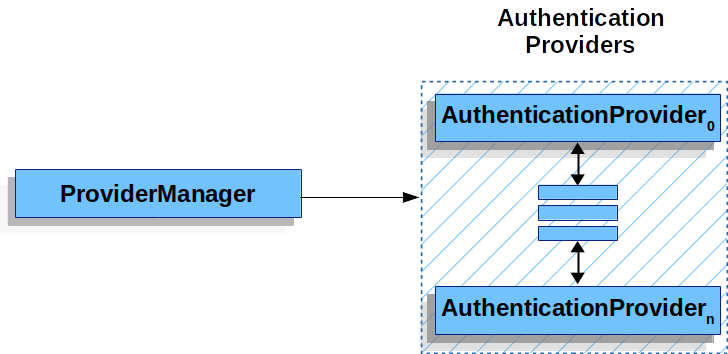
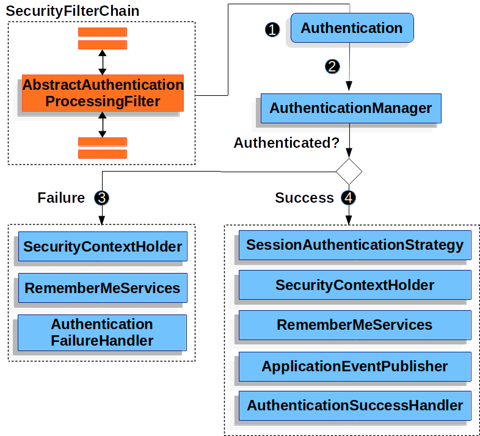

# 인증 메커니즘 종류
- Username and Password - 사용자 이름/비밀번호로 인증하는 방법
- OAuth 2.0 
- SAML 2.0 로그인
- CAS(Central Authentication Server) 
- Remember Me - 사용자의 과거 세션 만료를 기억하는 방법
- JAAS 인증
- 사전 인증 시나리오
SiteMinder 또는 Java EE 보안과 같은 외부 메커니즘으로 인증하지만 일반적인 공격으로부터 권한을 부여하고 보호하기 위해 여전히 Spring Security를 사용합니다.
- X509 인증 - X509 인증

### SecurityContextHolder
Spring Security가 '인증된 사람의 세부정보를 저장하는 곳'  
만약 값을 들고 있다면 현재 인증된 사용자로 사용된다.   
   
토큰 형식이다.   

### SecurityContext
SecurityContext는 SecurityContextHolder에 들어있고,   
이는 인증된 객체(Authentication)를 지니고 있다.

### Authentication

Authentication은 Spring Security 내에서 두 가지 주요 목적을 가지는 인터페이스입니다.
1. AuthenticationManager에 자격 증명 제공:    
    사용자가 제공한 자격 증명을 사용하여 사용자를 인증하기 위한 AuthenticationManager에 입력으로 사용됩니다.    
    이 경우 isAuthenticated() 메서드는 false를 반환합니다.

2. 현재 인증된 사용자를 나타냄:   
   SecurityContext에서 현재 Authentication을 얻을 수 있습니다.

Authentication은 다음과 같은 정보를 포함한다.

- principal(주체): 사용자를 식별합니다. 주로 사용자 이름/비밀번호로 인증할 때 UserDetails의 인스턴스입니다.

- credentials(자격 증명): 대부분 비밀번호입니다. 많은 경우, 사용자가 인증되면 이 정보는 누출되지 않도록 지워집니다.

- authorities(권한): GrantedAuthority 인스턴스는 사용자에게 부여된 고수준 권한을 나타냅니다. 예로는 역할(Roles)과 범위(Scopes)가 있습니다.

### GrantedAuthority
사용자에게 부여되는 고수준 권한으로, role, scope 와 같은 예가 있다.   

Authentication.getAuthorities() 메서드를 사용하여 GrantedAuthority 인스턴스를 얻을 수 있다.    
이 메서드는 GrantedAuthority 객체의 컬렉션을 제공한다. GrantedAuthority는 현재 부여된 권한을 나타내며 보통 "역할"(ROLE_ADMINISTRATOR 또는 ROLE_HR_SUPERVISOR와 같은)로 구성됩니다.   
이러한 역할은 나중에 웹 권한, 메소드 권한 및 도메인 객체 권한을 구성할 때 된다. 사용자 이름/비밀번호 기반 인증을 사용할 때, 일반적으로 GrantedAuthority 인스턴스는 UserDetailsService에서 로드된다.

GrantedAuthority는 특정 엔티티에 한정되지 않고 주어진 앱 전체 권한을 나타낸다. 특정 엔티티 객체 당 권한을 부여하게 되면 유저가 수백 수천으로 늘어나면 메모리가 빠르게 부족해진다. 따라서 Employee 44번 객체에게 GrantedAuthority를 부여하고 이런 일을 하지 않아도 된다.

### AuthenticationManager
Spring Security의 필터가 인증을 수행하는 방법을 정의하는 API      
Spring Security의 필터와 같은 Controller가 AuthenticationManager를 호출하면 Authentication 객체를 반환하는데,    
이는 SecurityContextHolder에 설정된다. AuthenticationManager의 구현할 수 있는 방법은 다양하다. 대표적으로는 ProviderManager라는 구현체가 있다. 

### ProviderManager

ProviderManager는 AuthenticationManager의 가장 일반적인 구현체이다.   
ProviderManager는 AuthenticationProvider 목록을 위임 받는다.   
각 AuthentaicationProvider는 인증 성공, 실패, 결정할 수 없음을 나타낼 수 있고, 나머지 AuthenticationProvider가 결정을 할 수 있도록 전달한다.

이 AuthenticationManager은 인증 성공/인증 실패/결정할 수 없음 으로 검사 가능하며,   
이 목록들을 ProviderMangaer가 위임받는다.   
AuthenticationManager은 username/pw, JWT token, SAML assertion 등 각각의 방식으로 수행 가능하다.   

### Request Credentials with AuthenticationEntryPoint
엑세스 권한이 주어진 리소스에 접근하려고 할 때??   
- 클라이언트가 액세스 권한 있을 때 ?    
  AuthenticationEntryPoint는 클라이언트로부터 자격 증명(credential)을 요청하는 HTTP 응답을 보냄    
-> 클라이언트는 리소스를 요청하기 위해 사용자 username/password와 같은 자격 증명을 사전에 포함함   
-> 이때는 Spring Security가 이미 해당 데이터가 포함되어 있기 때문에 클라이언트에게 자격 증명을 요청하는 HTTP 응답을 보낼 필요가 없음

- 클라이언트가 액세스 권한 없을 때 ?    
Spring Security에 해당 데이터가 없음 즉, unauthenticated
-> AuthenticationEntryPoint 구현체는 로그인 페이지로 리디렉션을 수행하고 WWW-Authenticate 헤더 등으로 응답

### AbstractAuthenticationProcessingFilter
사용자의 자격 증명을 인증을 처리하는 기본 필터   

1) 사용자가 자격 증명(credentials)을 제출하면 AbstractAuthenticationProcessingFilter가 인증될 HttpServletRequest에서 인증을 생성한다.
   - 생성된 인증 유형은 AbstractAuthenticationProcessingFilter의 하위 클래스에 따라 다르다.
   - 예를 들어, UsernamePasswordAuthenticationFilter는 HttpServletRequest에 제출된 사용자 이름과 암호에서 UsernamePasswordAuthenticationToken을 만든다.
2) 그리고 Authentication 객체는 인증을 하기 위해 AuthenticationManager로 전달된다.
   만약 인증이 실패하면 
3) Failure로 이동한다.   
   3-1) SecurityContextHolder가 지워진다.   
   3-2) RememberMeServices.loginFail이 호출된다. ‘remember me’가 구성되지 않은 경우에는 작동하지 않는다.   
   3-3) AuthenticationFailureHandler가 호출된다.   
   만약 인증이 성공하면 
4) Success로 이동한다.   
   4-1) SessionAuthenticationStrategy는 새 로그인에 대한 알림을 받는다.   
   4-2) Authentication은 SecurityContextHolder에서 설정된다. 나중에 SecurityContextPersistenceFilter는 SecurityContext를 HttpSession에 저장한다.   
   4-3) RememberMeServices.loginSuccess가 호출된다. ‘remember me’가 구성되지 않은 경우에는 작동하지 않는다.   
   4-4) ApplicationEventPublisher는 InteractiveAuthenticationSuccessEvent를 게시한다.   
   4-5) AuthenticationSuccessHandler가 호출된다.   